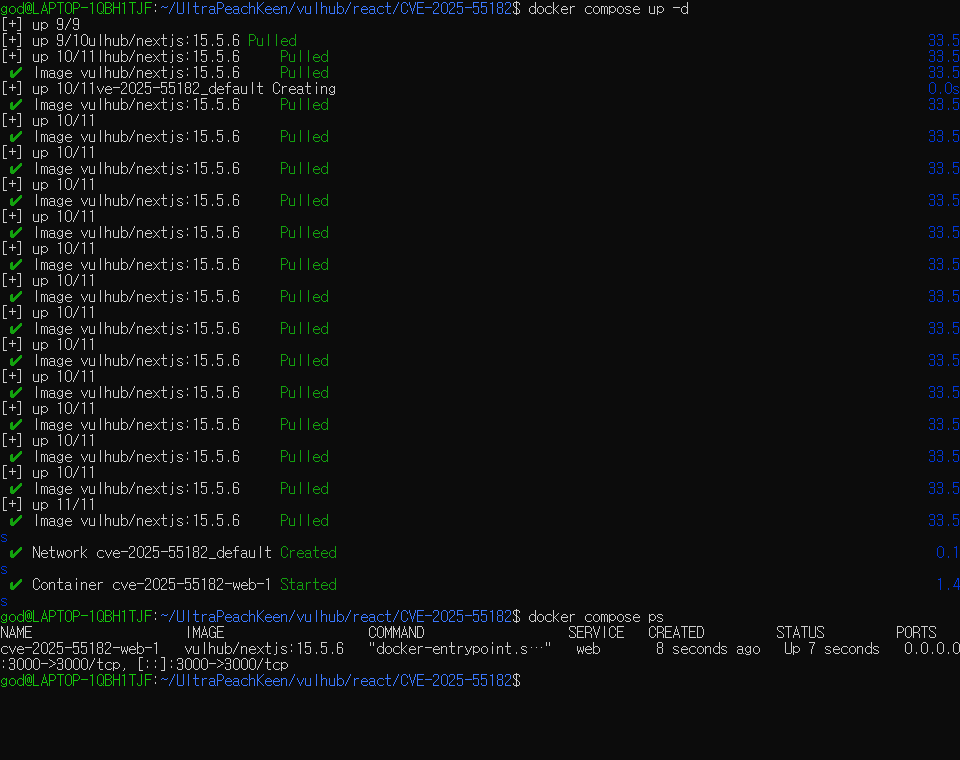
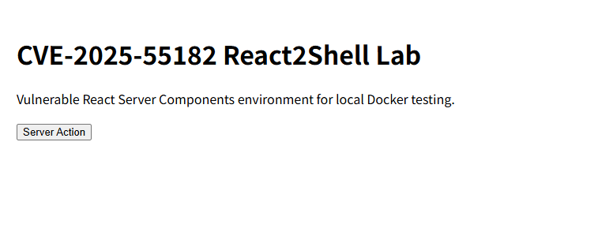
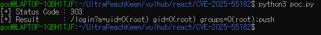

# CVE-2025-55182 Report

화이트햇스쿨 4기 18반 임채민

## 1. 취약점 요약

CVE-2025-55182(React2Shell)는 React Server Components(RSC)에서 발생하는 인증 없는(Pre-Authentication) 원격 코드 실행(RCE) 취약점이다.

React Server Components는 React 컴포넌트를 서버 측에서 실행한 후 그 결과를 클라이언트에 전달하는 기능이다. 해당 취약점은 React Server Function Endpoint로 전달된 Flight Protocol Payload를 React가 역직렬화하는 과정에서 발생한다.

공격자는 조작된 Flight Payload를 이용하여 서버 측 JavaScript 실행 흐름을 제어할 수 있으며, 최종적으로 Node.js Runtime 환경에서 임의의 운영체제 명령을 실행할 수 있다.

- CVE : CVE-2025-55182
- 취약점 유형 : Remote Code Execution (RCE)
- CWE : CWE-502 (Deserialization of Untrusted Data)
- CVSS : 10.0 (Critical)
- 인증 필요 여부 : 불필요
- 사용자 상호작용 : 불필요

## 2. 참조

[1] NVD, “CVE-2025-55182 Detail”  
https://nvd.nist.gov/vuln/detail/CVE-2025-55182

[2] CVE.org, “CVE Record: CVE-2025-55182”  
https://www.cve.org/CVERecord?id=CVE-2025-55182

[3] Vulhub, “react/CVE-2025-55182”  
https://github.com/vulhub/vulhub/blob/master/react/CVE-2025-55182/README.md

[4] 안랩, "React2Shell: 최신 웹 프레임워크를 위협하는 심각한 RCE 취약점 (CVE-2025-55182)"  
https://asec.ahnlab.com/ko/91660/

## 3. 환경 구성

| 항목 | 값 |
|------|------|
| 재현 이미지 | vulhub/nextjs:15.5.6 |
| 프레임워크 | Next.js |
| 버전 | 15.5.6 |
| 실행 방식 | Docker Compose |
| 서비스 포트 | 3000 |
| 운영체제 | Ubuntu (WSL2) |
| 공격 코드 | poc.py |

## 4. 실행 방법

### 4.1 Python 패키지 설치

PoC 실행에 필요한 Python 패키지를 설치한다.

#### macOS / Linux

```bash
python3 -m pip install -r requirements.txt
```

#### Windows

```powershell
py -3 -m pip install -r .\requirements.txt
```

### 4.2 취약 환경 실행

브라우저에서 다음 주소에 접속한다.

```text
http://localhost:3000
```

정상적으로 실행되면 React2Shell Lab 페이지를 확인할 수 있다.


### 4.3 서비스 확인

```bash
curl -i http://localhost:3000
```

정상적으로 실행되면 HTTP 200 응답과 React2Shell Lab 페이지를 확인할 수 있다.


### 4.4 취약점 재현

#### macOS / Linux

```bash
python3 poc.py
```

#### Windows

```powershell
py -3 .\poc.py
```

PoC 실행 후 응답 헤더에 포함된 명령 실행 결과를 확인한다.

예상 결과:

```text
[+] Status Code : 303
[+] Result      : /login?a=uid=0(root) gid=0(root) groups=0(root)
```

응답 헤더에 `uid=0(root)` 정보가 포함되면 서버 측 명령 실행이 성공한 것이다.

## 5. 취약 조건

| 조건 | 설명 |
|------|------|
| 취약 이미지 사용 | vulhub/nextjs:15.5.6 사용 |
| React Server Components 사용 | Flight Protocol 처리 |
| Server Action 처리 가능 | Next-Action 헤더 사용 |
| multipart/form-data 처리 | 공격 Payload 전달 |
| Node.js Runtime 사용 | 서버 측 코드 실행 가능 |

## 6. 공격 원리

React Server Components는 Flight Protocol 데이터를 서버에서 역직렬화하여 처리한다.

취약한 버전에서는 객체 참조를 해석하는 과정에서 프로토타입 체인 접근이 충분히 제한되지 않는다. 공격자는 이를 이용하여 JavaScript의 Function 생성자에 접근할 수 있으며, 서버 측에서 임의의 JavaScript 코드를 실행할 수 있다.

실행된 JavaScript는 Node.js의 child_process 모듈을 호출하여 운영체제 명령을 실행할 수 있으며, 이를 통해 원격 코드 실행이 가능해진다.

## 7. PoC 코드

Python으로 작성한 poc.py를 사용하였다.

PoC는 다음 과정을 수행한다.

1. 조작된 Flight Payload 생성
2. Next-Action 헤더 포함
3. multipart/form-data 요청 전송
4. 취약한 역직렬화 경로 진입
5. 서버 측 JavaScript 실행
6. id 명령 실행 및 결과 반환

PoC의 핵심은 Flight Payload 내부에서 JavaScript Function 생성자에 접근하는 것이다.

```json
{
  "then": "$1:__proto__:then",
  "_formData": {
    "get": "$1:constructor:constructor"
  }
}
```

취약한 React Server Components는 객체 참조를 해석하는 과정에서 프로토타입 체인 접근을 허용한다.

공격자는 `constructor:constructor` 경로를 이용하여 JavaScript의 Function 생성자에 접근할 수 있으며, `_prefix`에 포함된 문자열을 서버에서 실행할 수 있다.

## 8. 실행 결과

### 8.1 RCE 재현

PoC 실행 결과 서버에서 id 명령이 실행되었으며 다음과 같은 결과를 확인하였다.

```text
uid=0(root) gid=0(root) groups=0(root)
```


이는 공격자가 전송한 Payload가 서버에서 성공적으로 실행되었음을 의미한다.

## 9. 대응 방안

- Next.js 15.5.7 이상으로 업데이트
- React Server DOM 패키지 최신 버전 적용
- 신뢰할 수 없는 Flight Payload 차단
- Server Action Endpoint 노출 최소화
- 최신 보안 패치 적용

React는 패치를 통해 일반 객체가 내부 Response 객체를 위조하지 못하도록 수정하였으며, 프로토타입 체인을 통한 위험한 속성 접근을 제한하여 해당 취약점을 해결하였다.
